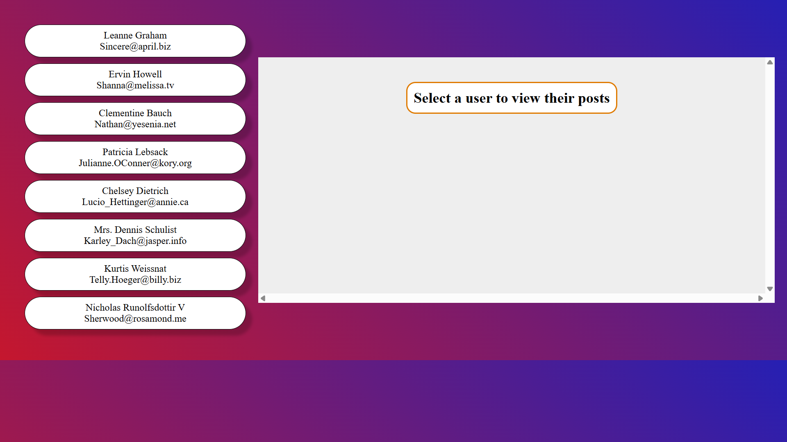

# AJAX Users & Posts

# AJAX Users & Posts Project ✅

A simple **AJAX project** built with **HTML, CSS, and Vanilla JavaScript**.
This is my **first API project**, where I fetch users and their posts from an external API and display them dynamically without page reload.

## Features

- 👤 Fetch and display users.
- 📄 Display posts for selected user.
- ✅ Dynamic update of content without reloading.
- Responsive and clean design for desktop and mobile.

## Screenshot

## Live Demo

[Click here to view the project](https://hajarhr55.github.io/ajax-users-posts/)

## 👩‍💻 Developer

- Hajar Al-Anazi

---

# مشروع AJAX للمستخدمين والمشاركات ✅

تطبيق بسيط باستخدام **HTML وCSS وVanilla JavaScript**.
هذا هو **أول مشروع API أقوم به**، حيث يقوم المشروع بجلب بيانات المستخدمين ومشاركاتهم من API خارجي ويعرضها بشكل ديناميكي دون إعادة تحميل الصفحة.

## المميزات

- 👤 عرض المستخدمين.
- 📄 عرض مشاركات المستخدم عند الاختيار.
- ✅ تحديث المحتوى بشكل ديناميكي بدون إعادة تحميل الصفحة.
- تصميم بسيط ومتجاوب على الجوال والكومبيوتر.

## لقطة شاشة

## العرض المباشر

[اضغط هنا لعرض المشروع](https://hajarhr55.github.io/ajax-users-posts/)

## 👩‍💻 المطورة

- هاجر العنزي
